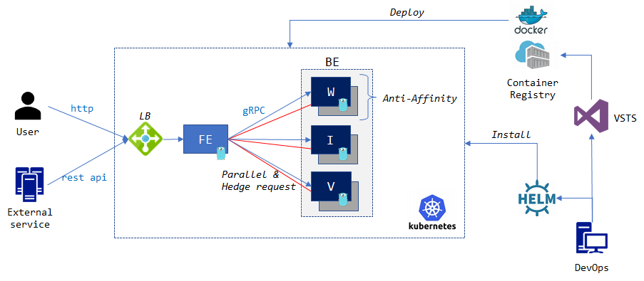

# Recipe for building Web-scale App

Simple search service demo app for building microservices based application.

This demo app demonstrates how to build a web-scale (agile, fault & variance, variance tolerant & hyper-scale) application.

## Architecture

- Search service is partitioned into smaller service, aka microservices

- Concurrent/parallel fan-out request for rapid response

- Backup/hedge request for reducing variance

- Better tools (Go, gRPC/protobuf, docker/K8S)

## How to run this demo

0. Test App on local environment

    Move [test](./test) directory

    Run `runtest.ps1` and/or `slotest.ps1`

1. Provision Kubernetes cluster

    Use `Azure acs / acs-engine` to deploy K8S cluster

    For more information, see [recipe/acs.md](./recipe/acs.md)

2. Build Docker Image

    Build docker images for frontend & backend app in [src](./src)

    For build and local test for docker images, see [recipe/docker.md](./recipe/docker.md)

    or use public docker hub image

3. Deploy Demo App

    Use sample yaml file to deploy frontend/backend app to K8S

    For more information, see [recipe/kube.md](./recipe/kube.md)

4. Deploy Search Service

    Use `Helm` to deploy demo app

    For more information, see [recipe/helm.md](./recipe/helm.md)

5. Integrate with VSTS (CI/CD)

    Create a project and save source code

    Create build & release definition

    For more information, see [recipe/vsts.md](./recipe/vsts.md)

## Reference

- http://research.google.com/people/jeff/Berkeley-Latency-Mar2012.pdf

- https://talks.golang.org/2012/concurrency.slide#1
    - https://github.com/golang/talks/tree/master/2012/concurrency/support
    - https://github.com/golang/talks/blob/master/2012/concurrency/support/google3.0.go

- https://talks.golang.org/2015/gotham-grpc.slide#1
    - https://github.com/golang/talks/tree/master/2015/gotham-grpc